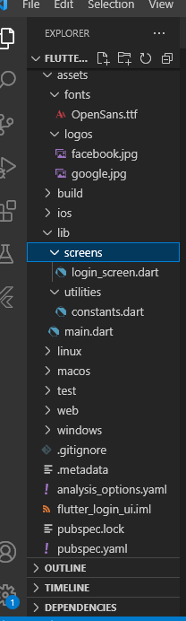

# utspemogramanmobile

## Membuat Halaman Login
1. Membuat nama projek yaitu flutter_login_ui, didalam projek ini terdapat beberapa file dan kita akan membuat file baru didalam projek ini dengan nama file assets didalam file assets terdapat file fonts dan logos. Font berfungsi untuk membuat tampilan lebih menarik sedangkan logos untuk menaruh gambar logo.
Berikut tampilan untuk nama file
